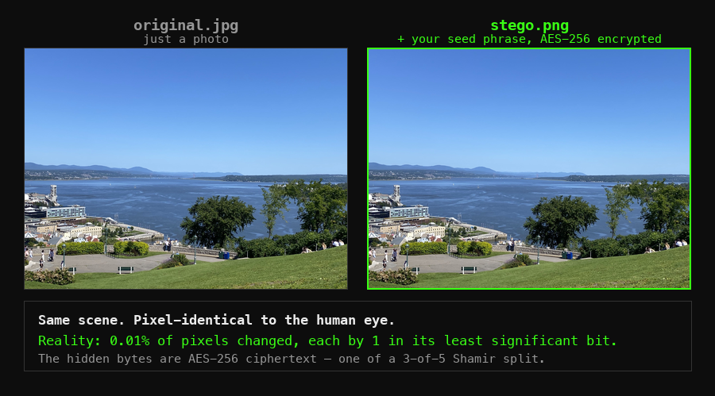

# stegosafeCLI


> **Encrypt. Split. Vanish.**  
> Your secrets hidden inside everyday images — and only you can bring them back.



*Both images above are real — the actual input and output of this tool. The right one carries a 12-word recovery phrase, AES-256-encrypted, as one of a 3-of-5 Shamir split. Measured difference: **0.01% of pixels, each changed by exactly 1** in its least significant bit.*

## 🎥 Demo Video

See how StegoSafe works in 45 seconds:

[](https://youtu.be/qNDmonpYXfk)

> 🧪 Try the web version now: [StegoSafe Web Demo →](https://stegosafe.com/demo/)  
> 📖 How it works, honestly: [What Happens When You Hide a Secret Inside a Photo →](https://stegosafe.com/blog/what-happens-when-you-hide-a-secret-in-a-photo/)  
> 🧰 Prefer the terminal? You're in the right place.

---

## ✨ Features

- **AES-256 Encryption**: Secrets are encrypted using AES-256 in CBC mode, with keys derived via PBKDF2 (100,000+ iterations).
- **Strong against quantum attacks**: Grover's algorithm only halves AES-256's effective key strength — to ~128 bits, still considered secure for the foreseeable future.
- **Shamir's Secret Sharing**: Your encryption key is split into 5 pieces — only 3 are needed to recover it.
- **Steganography**: Secrets are invisibly embedded inside ordinary PNG images, undetectable to the naked eye.
- **Threshold Recovery**: Lose 2 images? No problem. 3 shares are enough to recover your data.
- **100% Local**: All operations happen on your device. No cloud, no leaks.

---

## 📦 Requirements

- Python 3.6 or higher
- Install dependencies:
  ```bash
  pip install -r requirements.txt
  ```

Dependencies:
- cryptography
- Pillow
- numpy

---

## ⚙️ Installation

1. Clone this repository or download the source code.
2. Install the required Python packages:
   ```bash
   pip install -r requirements.txt
   ```

---

## 🚀 Usage

### Embedding a Secret

Encrypt and embed a secret into images:

```bash
python stegosafe_cli.py embed -i <input_folder> -s "<your_secret_text>" -o <output_folder>
```

Arguments:
- `-i`, `--input_folder`: Directory containing source images (PNG, JPG, or JPEG). At least 5 images are required — one per Shamir share. Output is always PNG.
- `-s`, `--secret`: The text you want to hide securely.
- `-o`, `--output_folder`: Directory where steganographic images will be saved.

**Example**:
```bash
python stegosafe_cli.py embed -i test_images -s "This is my hidden message" -o output_images
```

---

### Recovering a Secret

Recover the hidden secret from steganographic images:

```bash
python stegosafe_cli.py recover -i <stego_folder>
```

Arguments:
- `-i`, `--stego_folder`: Directory containing the steganographic images.

**Example**:
```bash
python stegosafe_cli.py recover -i output_images
```

---

## 🛡️ How It Works

1. **Encrypt** your secret with AES-256 and a randomly generated key.
2. **Split** the key into 5 shares using Shamir's Secret Sharing (threshold: 3 of 5).
3. **Embed** each share along with the full ciphertext into separate images using LSB steganography.
4. **Recover** the secret using any 3 valid stego images.

Even if attackers find some images, without the required threshold, **your secret remains mathematically protected**.

---

## 🔒 Security Notes

- **Keep them PNG, send them as files**: LSB data survives only while the file's bytes are untouched. It does **not** survive JPEG conversion, screenshots, resizing, or the recompression most chat apps apply to inline photos. Transfer stego images as *files/documents* (email attachment, "send as file", cloud drive), not as inline photos. [Full survival guide →](https://stegosafe.com/blog/what-happens-when-you-hide-a-secret-in-a-photo/)
- **Threshold Protection**: Fewer than 3 images reveal nothing about the secret — mathematically, not just "less".
- **Imperceptibility, not invisibility**: only least significant bits are modified, so visual inspection and naive analysis won't find it. Statistical steganalysis *can* flag LSB embedding — which is why the payload is AES-256-encrypted first: detection is not disclosure.
- **Complete Locality**: your data never leaves your machine.

---

## 🚀 What's Next?

For updates and improvements, follow this repo — or contribute!

🔒 **Protect your future secrets today — and be ready for tomorrow.**

> Stay tuned for updates. Follow the project for early access.

---

## ⚠️ Disclaimer

This tool is intended for lawful, ethical, and personal use only.  
The author assumes **no responsibility** for misuse.

---

## 📜 License

Released under the **MIT License**.
